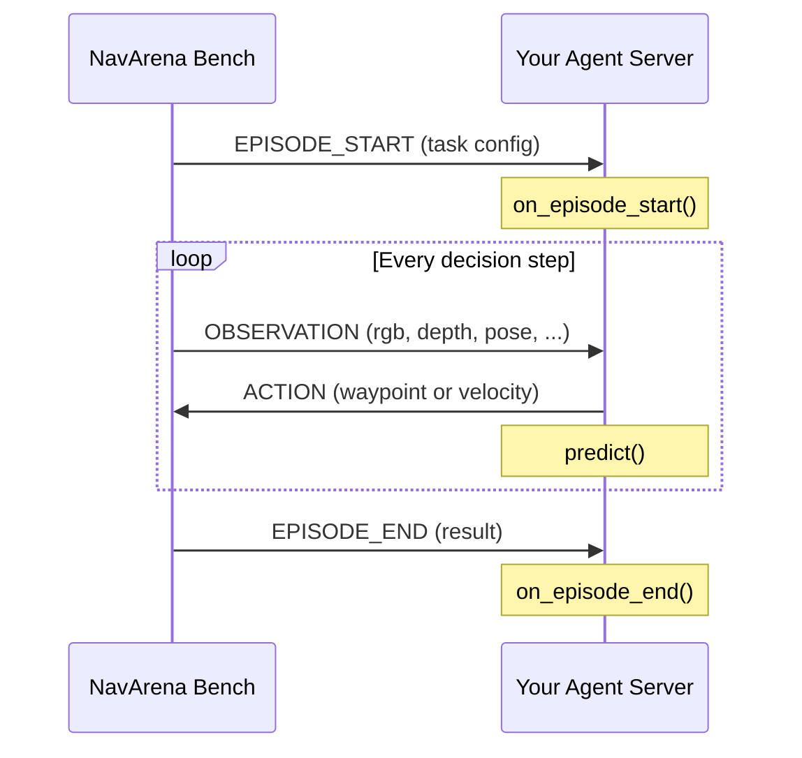

# NavArena-Server

Lightweight WebSocket model-server SDK for [NavArena](https://github.com/EI-Nav/NavArena) agent developers.

Implement a navigation agent in Python, expose it as a WebSocket server, and let the NavArena evaluation bench drive it — all in under 10 lines of code.

## Architecture

```
          ┌──────────────────┐  WebSocket (msgpack)  ┌──────────────────┐
          │  NavArena Bench  │ ◄──────────────────►  │  Your Agent      │
          │  (evaluation     │                       │  (model server)  │
          │   driver)        │                       │                  │
          └──────────────────┘                       └──────────────────┘
```

The bench acts as the **client**: it connects to your agent's WebSocket server, sends observations, and receives actions. Your agent acts as the **server**: it listens on a port, receives observations, runs inference, and returns actions.

Communication uses **WebSocket + msgpack** binary frames. An episode follows this lifecycle:



## Install

```bash
git clone https://github.com/EI-Nav/NavArena-Server.git
cd NavArena-Server
pip install -e .
```

**Requirements**: Python >= 3.9. Core dependencies (installed automatically): `websockets`, `msgpack`, `anyio`, `numpy`, `Pillow`.

## Quick Start

### 1. Write your agent

Subclass `NavigationModelServer` and implement `predict`:

```python
# my_agent.py
from navarena_server import NavigationModelServer, serve

class MyAgent(NavigationModelServer):
    async def predict(self, observation, ctx):
        # Your navigation logic here
        return {"waypoints": [{"x": 0.25, "y": 0.0, "yaw": 0.0}]}

if __name__ == "__main__":
    serve(MyAgent(), host="0.0.0.0", port=8000)
```

### 2. Start the server

```bash
python my_agent.py
# => Listening on ws://0.0.0.0:8000
```

### 3. Run the NavArena bench

Point the bench at your server (see [NavArena docs](https://ei-nav.github.io/NavArena-Doc/getting-started/quickstart) for bench setup):

```bash
# In the NavArena bench repo, configure model_server_url to ws://<host>:8000
```

The bench connects to your agent, streams observations, and collects actions — you only need to focus on the `predict` method.

## Core Concepts

### NavigationModelServer

The abstract base class for all agents. You **must** implement `predict`; lifecycle hooks are optional:

```python
from navarena_server import NavigationModelServer

class MyAgent(NavigationModelServer):

    async def predict(self, observation: dict, ctx: SessionContext) -> dict:
        """Called every decision step. Return an action dict."""
        ...  # required

    async def on_episode_start(self, payload: dict, ctx: SessionContext) -> None:
        """Called when an episode begins. Use for initialization."""
        ...  # optional

    async def on_episode_end(self, result: dict, ctx: SessionContext) -> None:
        """Called when an episode ends. Use for cleanup/logging."""
        ...  # optional
```

### SessionContext

Passed as `ctx` to every callback. Provides episode-level metadata:

| Property     | Type   | Description                                              |
|:------------:|:------:|:--------------------------------------------------------:|
| `session_id` | `str`  | Unique ID for the WebSocket connection                   |
| `episode_id` | `str`  | Unique ID for the current episode                        |
| `step`       | `int`  | Current decision step index (starts at 0)                |
| `is_first`   | `bool` | `True` on the first step of the episode                  |
| `task`       | `dict` | Task configuration from `EPISODE_START` (e.g. task type) |
| `mode`       | `str`  | `"sync"` or `"realtime"`                                 |
| `slot_id`    | `str` or `None` | Slot ID in batch mode, `None` otherwise          |

### serve() / serve_async()

Start the WebSocket server:

```python
from navarena_server import serve, serve_async

# Blocking (runs the event loop)
serve(agent, host="0.0.0.0", port=8000)

# Async (for integration into existing async applications)
await serve_async(agent, host="0.0.0.0", port=8000)
```

## Action Spaces

The action dict returned by `predict` must match `eval_settings.action_space` in the bench config. Two action spaces are supported:

### Waypoint (default)

Return one or more relative-pose waypoints. The bench executes them via its low-level controller.

```python
async def predict(self, observation, ctx):
    return {
        "waypoints": [
            {"x": 0.25, "y": 0.0, "yaw": 0.0}   # move forward 0.25m
        ]
    }
```

| Field | Type    | Description                            |
|:-----:|:-------:|:--------------------------------------:|
| `x`   | `float` | Forward displacement (meters)          |
| `y`   | `float` | Lateral displacement (meters)          |
| `yaw` | `float` | Heading change (radians)               |

### Velocity

Return a unicycle velocity command. The bench integrates via Euler: `x = v * dt`, `yaw = w * dt`.

```python
async def predict(self, observation, ctx):
    return {"v": 0.5, "w": 0.1, "dt": 0.1}
```

| Field | Type    | Description                                |
|:-----:|:-------:|:------------------------------------------:|
| `v`   | `float` | Linear velocity (m/s)                      |
| `w`   | `float` | Angular velocity (rad/s)                   |
| `dt`  | `float` | Duration of the command (seconds)          |

## Observation Format

The `observation` dict passed to `predict` contains sensor data from the simulator. Fields vary by task type.

**Common fields**:

| Field   | Type / Shape             | Description                     |
|:-------:|:------------------------:|:-------------------------------:|
| `rgb`   | `np.ndarray` (H, W, 3)   | RGB camera image (uint8)        |
| `depth` | `np.ndarray` (H, W)      | Depth map                       |
| `pose`  | `dict`                   | Agent pose (position, rotation) |

**Task-specific fields**:

| Field           | Task Type  | Type / Shape            | Description                              |
|:---------------:|:----------:|:-----------------------:|:----------------------------------------:|
| `goal_category` | ObjectNav  | `str`                   | Target object category (e.g. `"chair"`)  |
| `goal_image`    | ImageNav   | `np.ndarray` (H, W, 3)  | Goal-location image to match             |

NumPy arrays are automatically serialized/deserialized via msgpack custom codecs. Images (HWC uint8 arrays) are compressed during transport for efficiency.

## Lifecycle Hooks

Override these methods for episode-level setup and teardown:

```python
class MyAgent(NavigationModelServer):

    async def on_episode_start(self, payload, ctx):
        """Initialize per-episode state, load models, reset buffers, etc."""
        task_type = ctx.task.get("task_type", "unknown")
        print(f"[Episode {ctx.episode_id}] Starting {task_type} task")

    async def predict(self, observation, ctx):
        if ctx.is_first:
            # First observation of the episode
            goal = observation.get("goal_category")
            print(f"  Goal: {goal}")

        return {"waypoints": [{"x": 0.25, "y": 0.0, "yaw": 0.0}]}

    async def on_episode_end(self, result, ctx):
        """Log results, clean up resources."""
        success = result.get("success", False)
        print(f"[Episode {ctx.episode_id}] {'Success' if success else 'Fail'} "
              f"after {ctx.step} steps")
```

## Batch Mode

For GPU-based models that benefit from batched inference, override `batch_predict` to process multiple environments in a single forward pass:

```python
class BatchAgent(NavigationModelServer):

    async def predict(self, observation, ctx):
        # Single-environment fallback (called by default batch_predict)
        return self._infer_single(observation)

    async def batch_predict(self, observations, contexts):
        """Override for true batched inference across parallel environments.

        Args:
            observations: {slot_id: observation_dict, ...}
            contexts:     {slot_id: SessionContext, ...}

        Returns:
            {slot_id: action_dict, ...}
        """
        # Stack inputs, run one forward pass, split outputs
        batch_input = self._stack(observations)
        batch_output = self._model(batch_input)
        return {
            slot_id: {"waypoints": [wp]}
            for slot_id, wp in zip(observations, batch_output)
        }
```

Batch lifecycle hooks are also available:
- `on_batch_episode_start(payload, contexts)` — called when a batch of episodes begins
- `on_batch_episode_end(payload, contexts)` — called when episodes in the batch end

The default implementations delegate to the single-episode hooks (`on_episode_start` / `on_episode_end`) per slot.

## Examples

The `examples/` directory contains complete working agents:

| File                            | Task Type  | Action Space | Description                          |
|:-------------------------------:|:----------:|:------------:|:------------------------------------:|
| `random_waypoint_agent.py`      | PointNav   | Waypoint     | Random relative-pose waypoints       |
| `random_velocity_agent.py`      | PointNav   | Velocity     | Random unicycle velocity commands     |
| `objectnav_waypoint_agent.py`   | ObjectNav  | Waypoint     | Reads `goal_category`, random motion |
| `imagenav_velocity_agent.py`    | ImageNav   | Velocity     | Reads `goal_image`, random motion    |

Run any example:

```bash
python examples/random_waypoint_agent.py --port 8000
python examples/objectnav_waypoint_agent.py --port 8001
```

Each script accepts `--host` (default `0.0.0.0`) and `--port` (default `8000`).

## Development

### Project Structure

```
navarena-server/
├── navarena_server/
│   ├── __init__.py              # Public API exports
│   ├── _version.py              # Package version
│   ├── server/
│   │   ├── base.py              # NavigationModelServer, SessionContext
│   │   └── serve.py             # WebSocket server runner
│   └── protocol/
│       ├── messages.py          # MessageType, Message, pack/unpack
│       ├── connection.py        # Client-side Connection class
│       ├── numpy_codec.py       # NumPy array msgpack codec
│       └── image_codec.py       # Image compression codec
├── examples/                    # Ready-to-run agent examples
├── tests/                       # pytest test suite
└── pyproject.toml               # Package metadata and dependencies
```

### Running Tests

```bash
pip install -e .
pytest
```

## License

[MIT](https://opensource.org/licenses/MIT)
